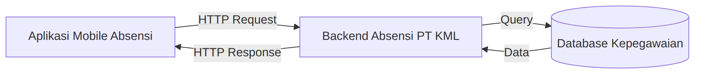
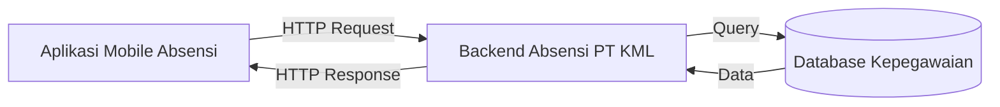

# Tugas 1 PAB — PresentGo (Aplikasi Absensi Organisasi)

**Nama:** Rian Rianto
**NIM:** 230660221004
**Domain:** Absensi organisasi (PT Kencana Makmur Lestari)

## 1. Deskripsi Sistem

Pengguna utama sistem ini adalah karyawan yang melakukan absensi harian, sedangkan pengguna lainnya adalah HRD/admin yang memantau dan merekap kehadiran. Masalahnya, pencatatan absensi secara manual atau melalui mesin di satu titik menyulitkan karyawan yang bekerja di luar kantor atau berpindah lokasi, rentan terhadap titip absen, dan membuat rekap kehadiran lambat diolah. Solusi berbentuk aplikasi mobile karena absensi adalah **sesi penggunaan singkat** yang dilakukan berulang kali sehari dan karena **konteks bergerak** memungkinkan aplikasi memakai GPS untuk memvalidasi lokasi saat absen. Selain itu, **konektivitas terbatas** di lapangan membuat aplikasi perlu menyimpan data absen secara lokal terlebih dahulu lalu mengirimkannya ketika sinyal kembali.

## 2. Diagram Arsitektur

Sumber diagram: `diagram.mmd`

## 3. Tabel Kebutuhan

| No. | Permintaan | Pengguna | Karakteristik Mobile yang Terkait | Fitur Aplikasi | Materi Pemenuh |
|---|---|---|---|---|---|
| 1 | Login dan melihat profil sendiri | Karyawan | **Layar kecil** — form login dan profil harus ringkas agar mudah diisi dengan satu tangan | Halaman login, halaman profil | Minggu ? |
| 2 | Absen masuk dan pulang dengan sekali tap | Karyawan | **Sesi penggunaan singkat** dan **interaksi sentuh** — absen harus selesai dalam hitungan detik lewat tombol besar | Tombol absen di beranda, konfirmasi hasil absen | Minggu ? |
| 3 | Absen hanya sah jika berada di area kerja | Karyawan | **Konteks bergerak** — posisi karyawan berubah-ubah sehingga lokasi perlu diverifikasi saat absen | Pengambilan koordinat GPS dan pengecekan radius lokasi kerja | Minggu ? |
| 4 | Absen tetap tercatat saat sinyal buruk | Karyawan | **Konektivitas terbatas** — sinyal di lapangan tidak stabil sehingga data harus tahan terhadap koneksi putus | Penyimpanan lokal dan sinkronisasi otomatis ke server | Minggu ? |
| 5 | Melihat riwayat kehadiran per bulan | Karyawan | **Layar kecil** dan **data terbatas** — daftar harus ringkas dan hemat pemuatan data | Halaman riwayat dengan filter bulan, cache lokal | Minggu ? |
| 6 | Mengajukan izin/sakit beserta bukti | Karyawan | **Konteks bergerak** — bukti (foto surat/dokumen) diambil langsung dari perangkat | Form pengajuan izin, unggah foto lewat kamera/pemilih file | Minggu ? |
| 7 | Mendapat pengingat absen | Karyawan | **Sesi penggunaan singkat** — pengguna tidak membuka aplikasi terus-menerus sehingga perlu diingatkan | Notifikasi lokal terjadwal | Minggu ? |
| 8 | Mengelola data karyawan, jadwal kerja, dan rekap laporan kehadiran | HRD/admin | — | **Di luar lingkup (backend SI)** | — |

## 4. Bukti Environment Siap

- `flutter doctor -v` sebelum perbaikan: [flutter-doctor/sebelum.png](flutter-doctor/sebelum.png)
- `flutter doctor -v` sesudah perbaikan: [flutter-doctor/sesudah.png](flutter-doctor/sesudah.png)
- Aplikasi counter berjalan: [aplikasi.png](aplikasi.png)

## 5. Refleksi

Fitur perangkat yang paling relevan untuk absensi organisasi adalah lokasi (GPS). Lokasi memungkinkan aplikasi memastikan karyawan benar-benar berada di area kerja saat absen sehingga titip absen dapat dikurangi. Kamera memang berguna sebagai pelengkap untuk bukti izin, tetapi validasi lokasi yang paling langsung menyelesaikan masalah utama absensi.
